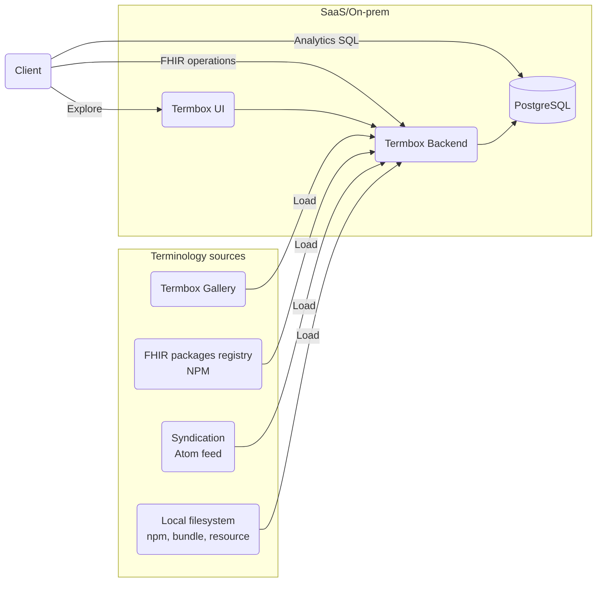

# Architecture

Termbox provides a FHIR terminology server with a web UI, a backend API, PostgreSQL persistence, and loaders for external terminology sources. It is designed to be easy to spin up from configuration, so teams can manage terminology content declaratively in the same spirit as infrastructure as code (terminology as code).

Termbox also exposes terminology capabilities at different levels of integration: interactive exploration through the UI, application integration through FHIR operations, and analytics workflows that need terminology data available from a relational database. The same core components can run in SaaS or on-prem deployments.

