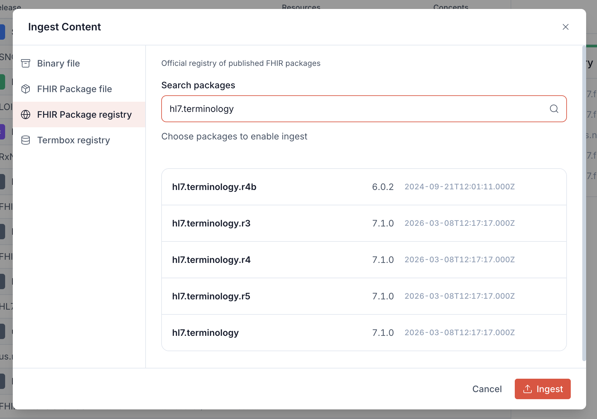

# Loading Data

Termbox does not ship with terminology content by default. Terminologies must be imported from external sources before they can be queried through the FHIR API.

Content can be loaded into Termbox through three main mechanisms:

- **Configuration file** – Declarative, file-based loading. Recommended for most deployments.
- **User interface** – For guided interactive loading
- **Admin API** – For scripted imports and automation

These mechanisms allow Termbox to retrieve data from a variety of source types:

| Source Type           | Description                                                                                                                                                | Current Status       |
| --------------------- | ---------------------------------------------------------------------------------------------------------------------------------------------------------- | -------------------- |
| FHIR Packages         | Standard FHIR Packages based on NPM. See https://hl7.org/fhir/packages.html                                                                               | ✅ Supported          |
| FHIR Bundles          | FHIR Bundle resources in JSON format                                                                                                                       | ✅ Supported          |
| Termbox Gallery       | Curated repository of terminologies, referenced by canonical URL                                                                                           | ✅ Supported          |
| FHIR Package registry | Ability to download packages (and dependencies) from registries such as: packages2, Simplifier, get-ig.org                                                 | ⚠️ Not yet supported |
| Syndication Feeds     | As described in the [NCTS Syndication feed spec](https://www.healthterminologies.gov.au/specs/v3/conformant-server-apps/syndication-api/syndication-feed/) | ⚠️ Not yet supported |
| FHIR CRUD API         | Live authoring FHIR resources via API                                                                                                                      | ⚠️ Not yet supported |

## Loading data via configuration file

The recommended way to load terminologies is via a `data.yaml` configuration file. This approach is declarative, version-controllable, and applied automatically on startup.

Create a `data.yaml` file listing the sources to load:

```yaml
sources:
  - type: npm
    package: hl7.terminology
  - type: npm
    package: hl7.fhir.r4.core
    version: 4.0.1
  - type: gallery
    url: http://snomed.info/sct
    version: http://snomed.info/sct/83821000000107   # optional: specific edition
  - type: gallery
    url: http://loinc.org
  - type: bundle
    location: /data/bundle.json
```

Each entry in `sources` specifies a `type` and type-specific fields:

| Type      | Description                                                    | Fields                                  |
| --------- | -------------------------------------------------------------- | --------------------------------------- |
| `npm`     | FHIR package from a package registry                           | `package`, optionally `version`         |
| `gallery` | Terminology from the Termbox Gallery, by canonical URL         | `url`, optionally `version`             |
| `bundle`  | FHIR Bundle file in JSON format                                | `location` (path inside the container)  |

Then mount the file into the container and point `DATA_CONFIG_FILE` to it:

```yaml
services:
  termbox:
    environment:
      DATA_CONFIG_FILE: /data/data.yaml
    volumes:
      - ./data.yaml:/data/data.yaml
```

Termbox will load and index all configured sources on startup.

## Loading data via UI

Let's load `hl7.terminology` as an example.

Navigate to `http://localhost:3000/ui/content` and click **Ingest**. In the modal, select **FHIR Package registry**.

Type `hl7.terminology` in the search box. A list of matching packages will appear:



Hover over `hl7.terminology` (version 7.1.0) and click **Use** to select it, then click **Ingest**. Termbox will download the package and all its dependencies from the registry automatically.

The UI also supports uploading FHIR package files and pre-indexed binary files directly — this is intended for special cases where content is not available through the registry or Gallery.

## Loading data via the Admin API

Let's load RxNorm via API:

```bash
curl -X POST "http://localhost:3000/admin/ingest" \
  -F "type=gallery" \
  -F "url=http://www.nlm.nih.gov/research/umls/rxnorm"
```

This starts a job and returns a job ID and a status endpoint:

```json
{
  "job": "05c0b880-00bf-49f0-97f7-c03d51ab4470",
  "status": "http://localhost:3000/admin/ingest/05c0b880-00bf-49f0-97f7-c03d51ab4470/status"
}
```

Poll the status endpoint to monitor progress:

```bash
curl "http://localhost:3000/admin/ingest/05c0b880-00bf-49f0-97f7-c03d51ab4470/status"
```

```json
{
  "key": "jobs.ingest/gallery",
  "status": "started",
  "start-time": 12460899320397,
  "progress": 40
}
```

The Admin API also supports uploading binary files directly for special cases where content is not available through the Gallery.
